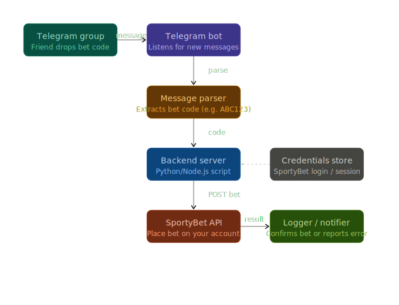

# SportyClaw Autoplacer
SportyClaw Autoplacer is a Telegram-driven SportyBet automation suite that pulls booking codes from your chats, runs Selenium to place bets, and enforces a daily allocation cap based on a dynamic risk engine so only a limited portion of the balance is used each day.

# Pipeline

## Core features

- **Telegram listener** (`main.py`, `bot/listener.py`): polls Telegram for text updates, ignores unauthorized senders, extracts SportyBet booking codes via `bot/parser.py`, and invokes `sportybet.client.place_bet_with_code` while checking the daily allocation. The Selenium client logs into SportyBet, enables the SportyInsure “One Cut” option, and stakes the computed amount before confirming the ticket. Successful bets include a quick allocation countdown in the reply; if the day’s allocation is gone, it replies with an exhaustion warning.
- **Telethon listener (optional)** (`bot/telethon_listener.py`): uses your personal Telegram account to watch configured groups/chats and pushes incoming text through the same authorization/parsing/placement pipeline used by the bot listener.
- **Bankroll engine** (`engine.py`, `bankroll.py`): every morning the bot scrapes the current SportyBet balance, computes a daily allocation cap from dynamic tier anchors, and spreads stakes across up to 30 bets. Unused allocation remains in the account and is included the next day when the balance is refreshed.
- **Health + reporting** (`health.py`, `bot/commands.py`, `reporter.py`): a HTTP `/health` endpoint plus a `/health` Telegram command that both output the latest stats, including allocation status and profit/loss. Daily reports scrape SportyBet, marry the scraped ledger with the in-memory stats, and DM the owner chat as Markdown.
- **Mocking & pytest coverage** (`bot/mock_handler.py`, `tests/*`): the parser, listener, bankroll, and health handlers are all exercised via pytest, and the mock update/message helpers let you run listener tests without Telegram or Selenium.

## Running the bot

1. Populate `.env` with at least `BOT_TOKEN`, `OWNER_CHAT_ID`, `ALLOWED_USER_ID`, and the SportyBet credentials (`SPORTYBET_PHONE`, `SPORTYBET_PASSWORD`). If you want to authorize additional Telegram users (e.g., people in other groups), set `ALLOWED_USER_IDS` to a comma-separated list of their numeric IDs; the listener accepts messages from anyone named in `ALLOWED_USER_ID` or `ALLOWED_USER_IDS`. The `/health` command will use `BOT_TOKEN` to send a normal left-side bot message in the same chat when it is set; otherwise it falls back to a regular same-chat response. To change the daily cap on how many bets can be placed, set `MAX_BETS_PER_DAY` (defaults to 30). To force `/health` to refresh the live SportyBet balance, set `HEALTH_REFRESH_BALANCE=1` (default).
2. Set your Telegram API credentials with either `API_ID`/`API_HASH` or the `TELETHON_API_ID`/`TELETHON_API_HASH` aliases used in some Railway setups. For group monitoring, set up to three chats with `TELETHON_CHAT_1`, `TELETHON_CHAT_2`, and `TELETHON_CHAT_3`. The old `TELETHON_CHATS` comma-separated value still works, but only the first 3 chats are monitored. You can set `PHONE_NUMBER` for first-time login and `TELETHON_REPLY_IN_CHAT=1` if you want placement replies inside the monitored group.
3. Install dependencies (ideally inside a virtualenv) with `python -m pip install -r requirements.txt`.
4. Run `python main.py`; the health server and Telegram polling start automatically. If Telethon is enabled, the Telethon listener also starts in the background.
5. Send booking codes through Telegram (or via the Telegram Bot API/ Postman) and keep an eye on `/health` to monitor the bankroll/quota breakdown.

## Bankroll mechanics recap

- The bot initializes the daily allocation by scraping SportyBet, parsing the balance string into a float (`bankroll.parse_balance`), and running `bankroll.initialize_from_amount`, which applies the dynamic tier anchors in `engine.py`.
- Before each bet, `listener.handle_message` verifies `bankroll.has_available_allocation()` is true, reserves a stake (`bankroll.reserve_stake()`), and on success reports how much allocation and how many bet slots remain. Failed bets release the stake back into availability so it can be retried.
- At midnight the scheduled job `run_daily_reset` resets both the stats and the bankroll (`bankroll.reset()`), then refreshes the balance again for the new day. Unused allocation remains in the account and is re-evaluated during the next refresh.

## Testing & health checks

- Run `python -m pytest tests` for parser, listener, health, and bankroll coverage.
- The `/health` HTTP endpoint and Telegram command share the same payload, showing both the ongoing stats and the remaining allocation/bet slots.

## Notes

- Selenium/Telegram packages may not be installed on every machine; use a virtualenv if the system rejects `pip install` in this repo.
- The parser ignores common words (`BOOKING`, `CODE`, etc.) and runs case-insensitive matching to avoid false positives. Adjust the regexes in `bot/parser.py` if your booking-code format differs.

---
Never Give Up,

 
